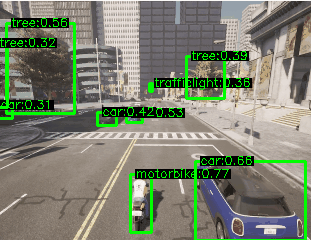

### Auto Annotator

Data Labeling for Machine Learning projects is usually a time-consuming activity. Thanks to GroundingDINO [1] project (detect anything with language - an open-set detection), this type of activity can be simplified and automated to speed up the process and get the focus on the model development. This project provides bounding box-based data collection, that uses a flexible search parameter to identify/detect the desired objects.

Example: ```"SEARCH_PATTERN":{"motorbike":"motorbike", "car":"car", "tree":"tree", "trafficlight":"traffic light"}```


<p align="center"> 
  </a>
  <div align="center">"Traffic movie", recorded with CARLA [3]"</div>
</p>

### Installation

Is recommended to use a conda environment for this installation.

1. conda create --name aanotator python=3.10, activate environment
2. if you have CUDA installed and want to use the GPU, check "nvidia-smi" for CUDA version (ie. 11.8). Check pytorch versions [2], for the corresponding installation of the components. If the conda variant can't be installed under the conda environment, use the corresponding pip variant.
3. Clone this project ```git clone https://github.com/fvilmos/auto_annotator```, in the root folder, clone the GroundingDINO project [1].
4. Navigate into the GroundingDINO directory and follow the installation instructions provided on the projects git page. Download the model weights to the root directory, into the ```./weights``` folder. Note: if you have the BERT model locally downloaded, navigate to ```GroundingDINO\groundingdino\config\GroundingDINO_SwinT_OGC.py``` and update the ```text_encoder_type = "bert-base-uncased"``` line with absolute path ```text_encoder_type = <path_to_the_bert_weights\\>```.
5. Configure your data collection strategy in the ```./utils/cfg.json``` file, and you are good to start collecting the data.

### Configuration

This project currently accepts ```web-cam-by-index, *.mp4, *.jpg, *.png``` file formats, as input and outputs in a directory the image frames with an unique ID and a info.meta file - holding all the meta information collected during the auto annotation activity.
All data-capture-related information is captured in the ```./utils/cfg.json``` file, take a look into it to understand the parameters.

```
"//1": "SOURCE accepts int values = camera index (integer) or string *.mp4 for local videos. if .jpg or .png is used images are loaded. See ACCEPTED_IMAGE_TYPES",
"//2": "if there are many videos to read out, use the FILE_INDEX to select the desired file.",
"//3": "if OUT_IMG_SIZE is missing [256,256], by default the original image size will be taken",
"//4": "if OUT_RESHAPE is 1 special resize is applied (img max size is taken from w or h), else a simple resize is done - destroys aspect ratio",
"//5": "use SEARCH_PATTERN to combine objects to be detected i.e. {'car':'all cars'}. the key is the one that will be saved ",
"//6": "use WRITE_TYPE to define how to store the processed data. 0-write data+meta file, 1-just visualize, 2-write just img with overlayed boxes + meta, 3 - img + overlayed img + meta",
"//7": "setting a CONFIDENCE_THRESHOLD integer i.e. 0.6 will filter out detections with the right confidence. Setting the value to None, will ignore this setting",
"//8": "FORCE_CPU - will force torch to run the model on CPU...for the PCs with no GPU",
```

### Output generated

All the files generated by the program will be stored in the ```BASE_PATH``` variable in the configuration ```./utils/cfg.json```, i.e. for 5 video files, the program will create 5 directories with 5 ```info.meta``` files.
Each line in the ```info.meta``` is structured in the following way:
```
{"id": "40699810207558558786321108528651", "source": ".\\data\\traffic.mp4", "file": "0_40699810207558558786321108528651.png", 
"orig_img_shape": [240, 320, 3], "work_img_shape": "None", 
"b_bbox": [
  {"bbox": [135, 172, 156, 231], "label": "motorbike", "confidence": "83", "style": "xyxy"}, 
  {"bbox": [200, 160, 310, 239], "label": "car", "confidence": "62", "style": "xyxy"}, 
  {"bbox": [143, 104, 153, 110], "label": "car", "confidence": "54", "style": "xyxy"}, 
  {"bbox": [125, 105, 137, 112], "label": "car", "confidence": "40", "style": "xyxy"}, 
  {"bbox": [11, 22, 79, 112], "label": "tree", "confidence": "56", "style": "xyxy"}, 
  {"bbox": [154, 82, 157, 90], "label": "trafficlight", "confidence": "36", "style": "xyxy"}, 
  {"bbox": [192, 55, 229, 97], "label": "tree", "confidence": "40", "style": "xyxy"}
  ]}
  ...next lines
```
The ```0_40699810207558558786321108528651.png``` image has 7 bounding boxes,  ```b_bbox``` holds this list of bounding boxes. The bounding box representation is ```[x1,y1,x2,y2] =[x upper left, y upper left, x right down, y right down]```


### Resources
1. [GroundingDINO project](https://github.com/IDEA-Research/GroundingDINO)
2. [torch CUDA enabled versions](https://pytorch.org/get-started/previous-versions/)
3. [CARLA simulator](https://carla.org/)


### Citations

```
@article{liu2023grounding,
  title={Grounding dino: Marrying dino with grounded pre-training for open-set object detection},
  author={Liu, Shilong and Zeng, Zhaoyang and Ren, Tianhe and Li, Feng and Zhang, Hao and Yang, Jie and Li, Chunyuan and Yang, Jianwei and Su, Hang and Zhu, Jun and others},
  journal={arXiv preprint arXiv:2303.05499},
  year={2023}
}
```

/Enjoy.
